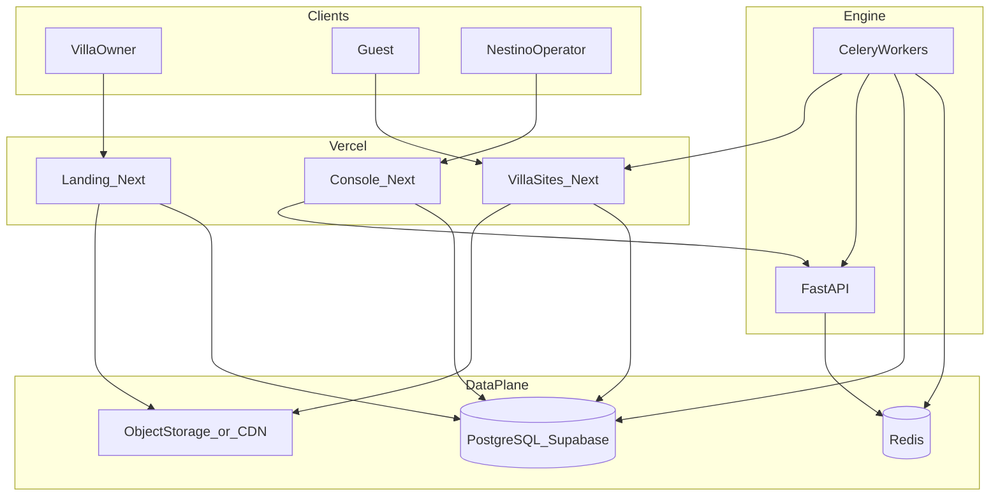

# Nestino — System Architecture

This document defines how the four subsystems fit together, how they communicate, and how they scale. **Implementation must match** [api-contracts.md](./api-contracts.md) and [data-model.md](./data-model.md).

## Subsystems

| Subsystem | Role | Primary runtime |
|-----------|------|-----------------|
| **Landing** (`apps/landing`) | Marketing site, trial capture, demo preview links | Vercel (Next.js) |
| **Villa sites** (`apps/villa-sites`) | Multi-tenant public sites per property; CMS API for engine | Vercel (Next.js Edge middleware) |
| **Operator console** (`apps/console`) | Internal UI: onboarding, content review, jobs, trials, reporting | Vercel (Next.js) + Clerk |
| **Engine** (`engine/`) | Background jobs, LLM calls, crawlers, integrations | FastAPI + Celery workers + Redis |

## High-level diagram

## Communication patterns

### Engine → Villa site (CMS)

- **Pattern:** Engine workers call the **tenant app’s HTTPS CMS API** (see [api-contracts.md](./api-contracts.md)).
- **Auth:** `Authorization: Bearer <CMS_API_KEY>` — villa app verifies against `sites.cms_api_key_hash`; engine loads plaintext via decrypt of `site_cms_credentials` (see [api-contracts.md](./api-contracts.md)).
- **Why not shared DB write from engine only:** Keeps tenant app the **authority** for publish, cache revalidation, and edge routing; engine remains orchestrator.

### Engine ↔ Operator console

- **Pattern A:** Console reads/writes **Postgres** via Supabase (server-side) for lists, trials, content queue.
- **Pattern B:** Console triggers jobs via **Engine FastAPI** (`POST /jobs/trigger`) with internal token.
- **Rule:** Long-running work **never** runs in the Next.js request; always enqueue Celery.

### Landing → data / engine

- **Trial activation:** Landing `POST /api/trials/activate` creates `tenants`, `sites`, `trials` rows (server-side). Optionally enqueues `CrawlSiteJob` via Engine API or DB + worker poll (choose one implementation path; document in landing tech-spec).
- **Demo page:** Reads `sites` by slug; embeds villa preview URL.

### Villa site → data

- **Reads:** Server Components / Route Handlers query Postgres (tenant resolved from `Host`).
- **Writes (public):** Inquiry form inserts `inquiries` only.

## Auth boundaries

| Surface | Auth |
|---------|------|
| Landing | Public; rate-limited forms |
| Villa sites | Public; CMS routes require API key |
| Console | **Clerk** (org + roles: `admin`, `editor`) |
| Engine API | Internal service token + IP allowlist (prod) |

## CDN & media

- **Static assets:** Vercel Edge / optional Cloudflare in front.
- **Property images:** **Supabase Storage** (default) or S3-compatible bucket + **CDN**; Next.js `Image` with `remotePatterns` for the storage host. **Canonical spec:** [image-pipeline-spec.md](../03-villa-sites/image-pipeline-spec.md) (paths, variants, `site_images`, alt text, hero accent).
- **Do not** commit large binaries to git.

## Background jobs

- **Broker:** Redis.
- **Workers:** Celery; one queue per priority (`high`, `default`, `low`) recommended.
- **Scheduler:** Celery Beat for cron-style jobs (e.g. nightly `PerformanceSyncJob`).
- **Idempotency:** Jobs keyed by `(tenant_id, job_type, idempotency_key)` where applicable.

### Default cadence (initial targets — tune in ops)

| Job | Cadence |
|-----|---------|
| CrawlSiteJob | On onboarding + weekly per active tenant |
| KeywordDiscoveryJob | Weekly per tenant per active language tier |
| OnSiteAuditJob | Twice weekly |
| PerformanceSyncJob | Daily |
| GEOMonitoringJob | Weekly per language tier (rate-limited) |
| OffSiteGapJob | Monthly |
| Content* jobs | Event-driven from opportunity queue |

## Deployment & environments

| Env | Purpose |
|-----|---------|
| `dev` | Local + preview branches |
| `staging` | Full integration with test Stripe, test keys |
| `prod` | Live |

- **Secrets:** Vercel env + Supabase + engine host secrets manager.
- **Migrations:** Run against staging before prod; engine and apps share one Postgres.

## Scaling notes

- **~10 tenants:** Single worker process, single Redis, DB small instance.
- **~100 tenants:** Horizontal Celery workers; separate Beat; Postgres with read replica optional; rate-limit external APIs aggressively; partition GEO jobs by tenant batch.
- **Bottlenecks:** LLM token usage, SERP/third-party quotas, crawl politeness — not Next.js.

## Failure isolation

- One failed job **must not** block unrelated tenants (separate task retries).
- Dead-letter queue or `engine_jobs.status = dead` with error payload for operator visibility.

## Related documents

- [data-model.md](./data-model.md)
- [api-contracts.md](./api-contracts.md)
- [../01-nestino-landing/tech-spec.md](../01-nestino-landing/tech-spec.md)
- [../02-engine/architecture.md](../02-engine/architecture.md)
- [../03-villa-sites/tech-spec.md](../03-villa-sites/tech-spec.md)
- [../04-operator-console/tech-spec.md](../04-operator-console/tech-spec.md)  
- [../03-villa-sites/image-pipeline-spec.md](../03-villa-sites/image-pipeline-spec.md)
