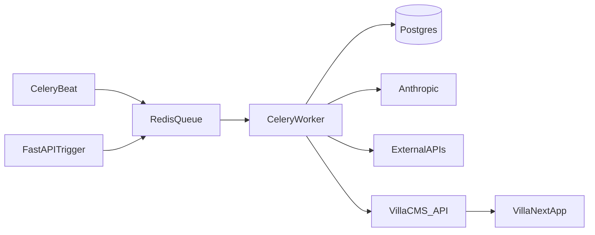

# Nestino Engine — Technical Architecture

## Components

| Component | Responsibility |
|-----------|----------------|
| **FastAPI** | Internal API for console, health, admin operations |
| **Celery workers** | Job execution (I/O + CPU + LLM calls) |
| **Redis** | Broker + result backend (if used) + rate-limit counters |
| **PostgreSQL** | System of record (shared schema) |
| **Anthropic API** | Generation + classification |
| **Crawler** | Playwright or Crawlee — tenant sites + external URLs |
| **Third-party APIs** | Search Console, Serp/Trends, optional OpenAI/Perplexity for GEO probes |

## Job pipeline diagram

## Worker boundaries

- **I/O tasks** (HTTP, DB, LLM) — async-friendly; enforce **timeouts**.  
- **CPU-light parsing** in worker process; heavy HTML parse chunked.  
- **No** long blocking calls > 60s without heartbeat.

## Agents (logical grouping)

| Agent | Jobs | Typical cadence |
|-------|------|------------------|
| Crawl | `CrawlSiteJob` | Onboarding + weekly |
| Keywords | `KeywordDiscoveryJob`, `ContentBriefJob` | Weekly + queue-driven |
| Content | `ContentGenerationJob`, `ContentHumanizerJob`, `ContentPublishJob` | Queue-driven |
| Insights | `DestinationInsightsSyncJob` | Weekly per destination |
| Audit | `OnSiteAuditJob` | 2× / week |
| GEO | `GEOMonitoringJob` | Weekly (batched) |
| Off-site | `OffSiteGapJob` | Monthly |
| Performance | `PerformanceSyncJob` | Daily |

## Failure isolation

- **Per-tenant task routing:** `tenant_id` in task kwargs; failure doesn’t poison global queue.  
- **Retries:** exponential backoff, `max_retries = 3` default.  
- **Dead letter:** `engine_jobs.status = dead` with `last_error` after max retries.  
- **Partial writes:** prefer **transactional** DB updates per job stage.

## Rate limiting

| Dependency | Strategy |
|------------|----------|
| Anthropic | Token bucket per org; queue smoothing |
| Search Console | Daily quota-aware batching |
| SERP API | Cache 24–72h per `(keyword, lang, locale)` |
| Crawler | Per-host concurrency = 1; polite delays |
| GEO probes | Strict weekly caps per tenant × platform |

## Scaling

- **Horizontal:** add Celery workers; split queues (`high`, `default`, `low`).  
- **Beat:** single leader or Redis lock.  
- **DB:** indexes per [data-model.md](./data-model.md).  
- **100+ tenants:** partition GEO jobs; precompute keyword batches; run `DestinationInsightsSyncJob` in destination shards; consider read replica for analytics queries.

## Capacity estimates and cost model

**All figures below are planning estimates — validate against real usage and current vendor pricing after the first ~5 active tenants.** Update this section when measured.

### Assumptions (MVP cadence)

- One **active** tenant, **2 Tier-1 languages** (`en` + one more), content pipeline producing ~**2–4** new briefs/pages per month per tenant (not maxed-out generation).
- GEO: **~5 queries × 2 languages × 1 platform** weekly (rate-limited); expand later.

### LLM calls per tenant per week (order of magnitude)

| Job | Calls / week (approx.) | Notes |
|-----|-------------------------|--------|
| `KeywordDiscoveryJob` | 2–4 per language | LLM expansion + classification; batch where possible |
| `ContentBriefJob` | 0–2 | Only when opportunities consumed |
| `ContentGenerationJob` | 0–2 | Per page queued |
| `ContentHumanizerJob` | 0–2 | Matches generation |
| `OnSiteAuditJob` | 2× × (2–5 pages) classifiers | Haiku-class; optional meta/FAQ sub-steps |
| `GEOMonitoringJob` | 1 batch | Query generation + optional probe parsing |
| `OffSiteGapJob` | ~0.25 | Monthly amortized |
| `CrawlSiteJob` | 1 | Weekly; minimal LLM unless enrichment on |

### Token budget (rough, per tenant per month)

| Call type | Input tok (range) | Output tok (range) |
|-----------|-------------------|---------------------|
| Long-form page + humanizer | 4k–12k each pass | 2k–6k each pass |
| Brief / classifier / meta | 1k–4k | 0.5k–2k |
| Keyword expansion (per lang) | 2k–8k | 1k–3k |

**Directional monthly total:** ~**0.5M–2M input** + ~**0.2M–1M output** tokens per tenant at moderate activity (highly variable with page volume).

**Anthropic cost:** multiply by **current** Sonnet/Haiku price per million tokens from Anthropic’s pricing page; expect a **tens of USD / month / tenant** range for LLM alone at MVP intensity — **not** a substitute for metering.

### SERP / keyword API

- **~50–200 cached calls / tenant / week** (depends on language count and seed expansion), TTL 48–72h per `(keyword, hl, gl)`.
- Budget **~$20–80 / tenant / month** at common SERP API tiers — **validate** with chosen provider.

### Infrastructure (directional monthly USD)

| Scale | Postgres (Supabase) | Redis | Celery workers | Engine host (API + workers) |
|-------|---------------------|-------|----------------|-----------------------------|
| ~10 tenants | Small Pro / equiv. | Small managed | 1–2 processes | Single small VM or PaaS |
| ~50 tenants | Mid tier | Dedicated small | 2–4 workers | 1–2 instances |
| ~100 tenants | Scale / read replica | Standard | 4–8 workers | Horizontal workers |

Add **Vercel** costs for three Next apps separately (not engine); not included in engine row above.

### Unit economics (illustration only)

- **Revenue:** ~**$349 / tenant / month** ([strategy.md](../../strategy.md)).
- **Variable cost:** LLM + SERP + infra share + amortized operator time for review.
- **Target:** keep **gross margin** healthy enough to cover ops; re-price or cap generation if LLM + SERP exceed ~**25–35%** of subscription without adding value.

### Rate-limit budget allocation

- **Fair-share:** default equal API budget per `trial`/`active` tenant per day.  
- **Priority-weight:** optional boost for `active` vs `trial`, or Tier-1 languages vs Tier-3.  
- **Global ceiling:** stop enqueueing low-priority jobs when provider quota &lt; threshold; surface `engine_tasks` “API quota — resume tomorrow”.

---

## Security

- Secrets in env / vault; never in job `payload_json` logs.  
- CMS keys only in memory during publish job.  
- Sanitize external HTML before LLM context.

## Observability

- Structured JSON logs with `job_id`, `tenant_id`, `job_type`.  
- Metrics: job duration, LLM tokens, error rate by type.  
- Alerts on queue depth + Beat missed ticks.

## Related

- [jobs-spec.md](./jobs-spec.md)  
- [integrations-spec.md](./integrations-spec.md)  
- [testing-spec.md](./testing-spec.md)  
- [seed-data-spec.md](./seed-data-spec.md)  
- [../00-system/architecture.md](../00-system/architecture.md)
