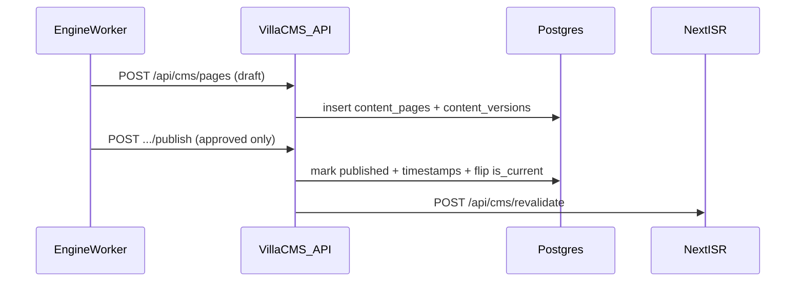

# Nestino Villa Sites — Engine Integration Contract

This document binds **engine behavior** to **villa app implementation**. Canonical endpoint definitions: [../00-system/api-contracts.md](../00-system/api-contracts.md).

## Publish flow (happy path)



**Default engine pipeline:** `ContentGenerationJob` creates the first version as **`draft`** via CMS; **`ContentHumanizerJob`** then writes the next version as **`pending_review`** (same `page_id` / `language_code`, incremented `version`). The diagram above compresses multiple CMS calls into one “draft” step for clarity.

## Auth

- Header: `Authorization: Bearer <CMS_API_KEY>`  
- Key generated at site creation; **hashed** in DB; shown **once** in console UI.

## Payload: `body_json` block schema (portable)

Every `body_json` object **MUST** include top-level **`version`** (integer). Current contract: **`version: 1`**. Omitting `version` is treated as **`1`** in readers for backfill only; **new writes** must set it explicitly.

```json
{
  "version": 1,
  "blocks": [
    { "type": "paragraph", "text": "string" },
    { "type": "h2", "text": "string" },
    { "type": "h3", "text": "string" },
    { "type": "bullet_list", "items": ["string"] },
    { "type": "image", "src": "https://...", "alt": "string", "caption": "string" },
    { "type": "faq", "items": [{ "q": "string", "a": "string" }] },
    { "type": "cta", "label": "string", "href": "string", "variant": "primary|secondary" }
  ]
}
```

### Block schema versioning

- **`SUPPORTED_MAX`:** villa app and console `BlockRenderer` declare the maximum `body_json.version` they fully support (e.g. `SUPPORTED_MAX = 1` at MVP).
- **Forward compatibility:** if `version <= SUPPORTED_MAX`, render all known block types. If `version > SUPPORTED_MAX`, render **best effort** (render known blocks, **skip** unknown types) and **log a warning** once per page load — do not fail the entire page silently with zero content without logging.
- **Block type registry:**
  - **v1:** `paragraph`, `h2`, `h3`, `bullet_list`, `image`, `faq`, `cta`
  - **Future versions:** adding a **new** block type or breaking shape change **bumps** `body_json.version` (v2, v3, …). Document new types in this section when shipped.
- **Rollout order when adding types:** (1) Deploy villa app + console renderer that recognizes new types (still accepts old `version`). (2) Deploy engine that emits new `version` + types. Older renderers may skip unknown blocks until upgraded.

**Renderer obligation:** unknown block types **within** a supported schema version: skip block + **structured log** (`site_id`, `page_id`, `block.type`).

**Legacy rows:** historical `body_json` may omit `version`; readers **must** treat missing `version` as **`1`**.

## Schema injection contract

- `schema_json` MUST be valid JSON-LD object or array.  
- Villa app injects **verbatim** inside `<script type="application/ld+json">`.  
- Sanitize: reject if `</script>` substring appears.

## Review gating

- `POST /api/cms/pages/:id/publish` allowed only if:

```sql
content_versions.status = 'approved'
```

- If operator override used, require header `X-Nestino-Override: operator` + separate audit log table (future).

## Rollback

- `PUT /api/cms/pages/:pageId/rollback` (implement alongside CMS)  
- Request:

```json
{ "language_code": "en", "to_version": 3 }
```

- Creates a **new** row whose **`version` = `MAX(version) + 1`** over all `content_versions` for that `(page_id, language_code)` — **not** `to_version + 1`. Example: if versions 1–5 exist and the operator rolls back to content from `to_version: 3`, the new row is version **6**, cloning fields from version 3, with `source=human` and `status=draft` (or per policy).  
- Prior published row’s `is_current` is unchanged until the new version is published through the normal approve/publish flow.

## hreflang sync

- On `POST /api/cms/languages`, site rebuilds language list used by layout component.  
- Engine triggers `revalidate` for all top routes.

## Robots updates

- `PUT /api/cms/robots` replaces template; `robots.ts` reads from DB.

## Sitemap revalidation

- Any publish triggers path revalidation + optional `POST /api/cms/sitemap` (or `revalidateTag('sitemap')` internally). See [api-contracts A6b](../00-system/api-contracts.md).

## Idempotency

- `POST /api/cms/pages` with same `slug` + `site_id` → `409 conflict`  
- Engine should upsert via `PUT` when page exists.

## Failure modes

| Error | Engine behavior |
|-------|------------------|
| 401 | rotate key workflow |
| 409 | fetch existing page id then PUT |
| 5xx | retry with backoff |
| Validation | create `engine_tasks` |

## Related

- [../02-engine/jobs-spec.md](../02-engine/jobs-spec.md)  
- [image-pipeline-spec.md](./image-pipeline-spec.md)  
- [tech-spec.md](./tech-spec.md)
